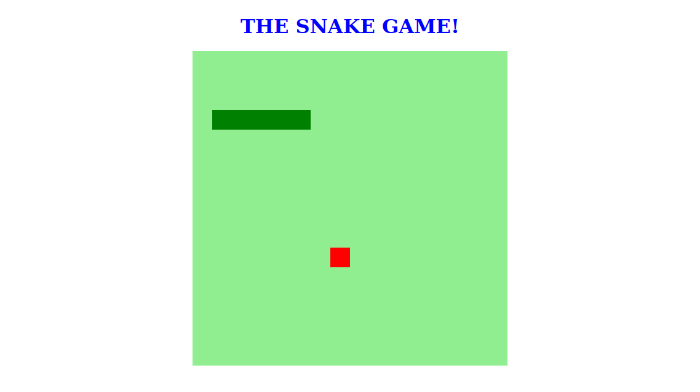

# SNAKE GAME!

Este jogo clássico da cobrinha foi desenvolvido durante o Bootcamp Front-end Developer da SPTech na [Digital Innovation One](). Tod projeto foi desenvolvido usando HTML5, CSS3, e Javascript.

Atualmente o jogo tem as funcionalidades padrões incluindo o aumento de tamanho quando consome o alimento e game over quando a cobra se choca com ela mesma.

## Funcionalidade futuras

- Adição de opções para início/reinício do jogo sem ter que recarregar a página;
- Estilização mais sofisticada;
- Adição de  um sistema de pontuação;
